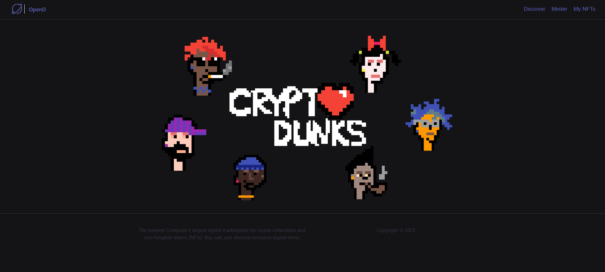
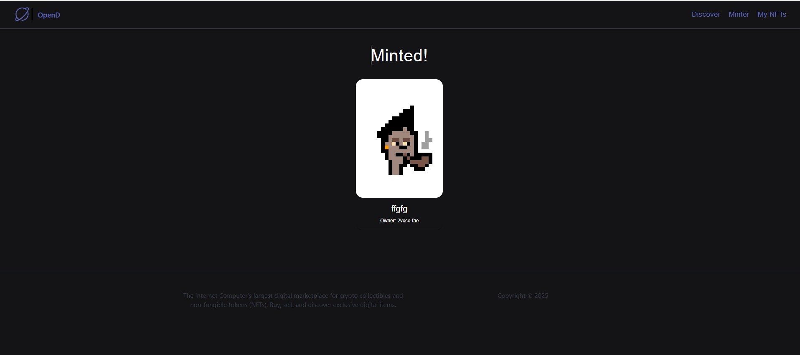
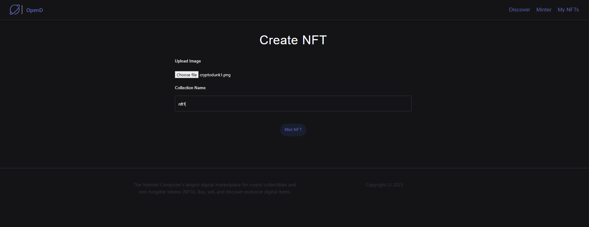
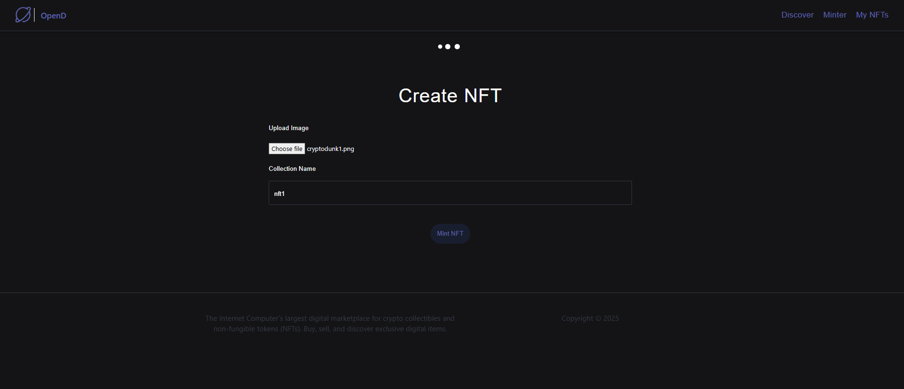
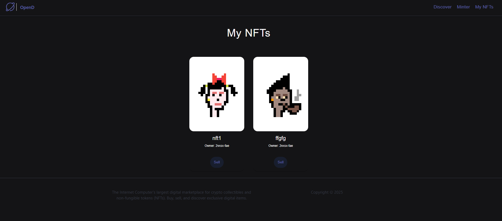
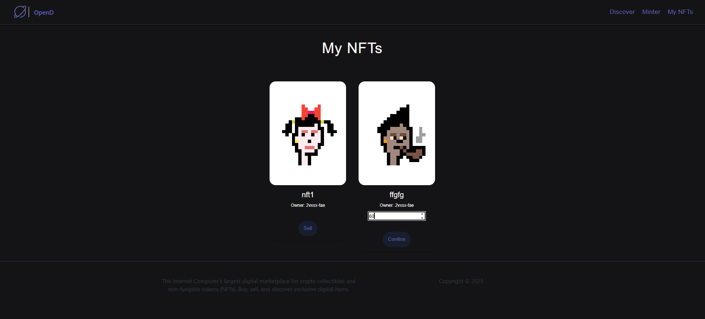
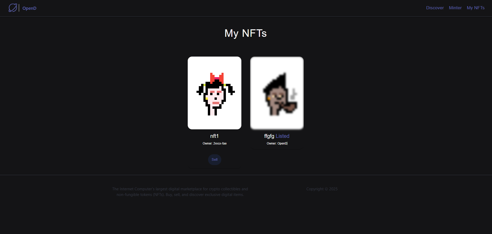

# 🖼️ OpenD – Decentralized NFT Marketplace

**OpenD** is a decentralized NFT marketplace built on the **Internet Computer (ICP)**.  
It allows users to mint, list, and sell NFTs seamlessly using Motoko smart contracts.

---

## 🚀 Project Overview

| Feature | Description |
|----------|--------------|
| **Name** | OpenD (CryptoDunks NFT Marketplace) |
| **Frontend** | React + ICP Assets Canister |
| **Backend (Marketplace Logic)** | Motoko Smart Contract (`opend`) |
| **NFT Logic** | Motoko Smart Contract (`nft`) |
| **Token Integration** | Dang Token (for pricing NFTs) |

---

## 📦 Canister Details

| Canister | Canister ID | Purpose |
|-----------|--------------|----------|
| **nft** | `rrkah-fqaaa-aaaaa-aaaaq-cai` | Stores NFT logic (mint, transfer, metadata). |
| **opend** | `ryjl3-tyaaa-aaaaa-aaaba-cai` | Backend marketplace logic. |
| **opend_assets** | `r7inp-6aaaa-aaaaa-aaabq-cai` | React frontend served to browser. |

---

## 👤 Developer Identity

Principal ID: okwwr-vkfpp-ctjax-3ia63-sz6js-4qysc-hz5gp-4vkfw-4442b-7aisf-fqe


## 🧩 Installation and Setup

### 1️⃣ Start the Local ICP Replica

```bash
dfx start --clean
```

2️⃣ Deploy the Canisters
```bash
    dfx deploy --argument='("CryptoDunks #123", principal "okwwr-vkfpp-ctjax-3ia63-sz6js-4qysc-hz5gp-4vkfw-4442b-7aisf-fqe", (vec {137; 80; 78; 71; 13; 10; 26; 10; 0; 0; 0; 13; 73; 72; 68; 82; 0; 0; 0; 10; 0; 0; 0; 10; 8; 6; 0; 0; 0; 141; 50; 207; 189; 0; 0; 0; 1; 115; 82; 71; 66; 0; 174; 206; 28; 233; 0; 0; 0; 68; 101; 88; 73; 102; 77; 77; 0; 42; 0; 0; 0; 8; 0; 1; 135; 105; 0; 4; 0; 0; 0; 1; 0; 0; 0; 26; 0; 0; 0; 0; 0; 3; 160; 1; 0; 3; 0; 0; 0; 1; 0; 1; 0; 0; 160; 2; 0; 4; 0; 0; 0; 1; 0; 0; 0; 10; 160; 3; 0; 4; 0; 0; 0; 1; 0; 0; 0; 10; 0; 0; 0; 0; 59; 120; 184; 245; 0; 0; 0; 113; 73; 68; 65; 84; 24; 25; 133; 143; 203; 13; 128; 48; 12; 67; 147; 94; 97; 30; 24; 0; 198; 134; 1; 96; 30; 56; 151; 56; 212; 85; 68; 17; 88; 106; 243; 241; 235; 39; 42; 183; 114; 137; 12; 106; 73; 236; 105; 98; 227; 152; 6; 193; 42; 114; 40; 214; 126; 50; 52; 8; 74; 183; 108; 158; 159; 243; 40; 253; 186; 75; 122; 131; 64; 0; 160; 192; 168; 109; 241; 47; 244; 154; 152; 112; 237; 159; 252; 105; 64; 95; 48; 61; 12; 3; 61; 167; 244; 38; 33; 43; 148; 96; 3; 71; 8; 102; 4; 43; 140; 164; 168; 250; 23; 219; 242; 38; 84; 91; 18; 112; 63; 0; 0; 0; 0; 73; 69; 78; 68; 174; 66; 96; 130;}))'
```
3️⃣ Run the Frontend Server

```bash

    npm start
```

### 4️⃣ Open in Browser

[http://localhost:8080/](http://localhost:8080/)

---

## 🖼️ Preview – App Screenshots

| NFT Mint Page | NFT Minted Page |
|:--:|:--:|
|  |  |

| NFT Listing Page | My NFTs Page |
|:--:|:--:|
|  |  |

| NFT Sell Confirmation | Discover NFTs |
|:--:|:--:|
|  |  |

| CryptoDunks Banner |   |
|:--:|:--:|
|  |   |

---

## ⚙️ Useful DFX Commands
## 🔹 Check NFT Details
```bash
dfx canister call nft getName
dfx canister call nft getOwner
dfx canister call nft getAsset
```


## 🔹 Retrieve Canister IDs
```bash
dfx canister id nft
dfx canister id opend
dfx canister id opend_assets
```
## 💰 Listing and Selling NFTs


## List NFT for Sale
```bash
dfx canister call opend listItem '(principal "rrkah-fqaaa-aaaaa-aaaaq-cai", 2)'
```

## Transfer Ownership to Marketplace
```bash
dfx canister call rrkah-fqaaa-aaaaa-aaaaq-cai transferOwnership '(principal "ryjl3-tyaaa-aaaaa-aaaba-cai", true)'
```

## Confirm Listing on Frontend

* Enter your price (in JELLY tokens)

* Click Confirm


## 🧠 Technologies Used

* Motoko – Smart contract language for ICP

* React.js – Frontend Framework

* Internet Identity / Principal – User authentication

* ICP Canisters – For deploying modular services

* JELLY Token – Used for NFT pricing


## Creating NFT for Testing

1. Mint an NFT on the command line to get NFT into mapOfNFTs:

```
dfx canister call opend mint '(vec {137; 80; 78; 71; 13; 10; 26; 10; 0; 0; 0; 13; 73; 72; 68; 82; 0; 0; 0; 10; 0; 0; 0; 10; 8; 6; 0; 0; 0; 141; 50; 207; 189; 0; 0; 0; 1; 115; 82; 71; 66; 0; 174; 206; 28; 233; 0; 0; 0; 68; 101; 88; 73; 102; 77; 77; 0; 42; 0; 0; 0; 8; 0; 1; 135; 105; 0; 4; 0; 0; 0; 1; 0; 0; 0; 26; 0; 0; 0; 0; 0; 3; 160; 1; 0; 3; 0; 0; 0; 1; 0; 1; 0; 0; 160; 2; 0; 4; 0; 0; 0; 1; 0; 0; 0; 10; 160; 3; 0; 4; 0; 0; 0; 1; 0; 0; 0; 10; 0; 0; 0; 0; 59; 120; 184; 245; 0; 0; 0; 113; 73; 68; 65; 84; 24; 25; 133; 143; 203; 13; 128; 48; 12; 67; 147; 94; 97; 30; 24; 0; 198; 134; 1; 96; 30; 56; 151; 56; 212; 85; 68; 17; 88; 106; 243; 241; 235; 39; 42; 183; 114; 137; 12; 106; 73; 236; 105; 98; 227; 152; 6; 193; 42; 114; 40; 214; 126; 50; 52; 8; 74; 183; 108; 158; 159; 243; 40; 253; 186; 75; 122; 131; 64; 0; 160; 192; 168; 109; 241; 47; 244; 154; 152; 112; 237; 159; 252; 105; 64; 95; 48; 61; 12; 3; 61; 167; 244; 38; 33; 43; 148; 96; 3; 71; 8; 102; 4; 43; 140; 164; 168; 250; 23; 219; 242; 38; 84; 91; 18; 112; 63; 0; 0; 0; 0; 73; 69; 78; 68; 174; 66; 96; 130;}, "CryptoDunks #123")'
```

2. List the item into mapOfListings:

```
dfx canister call opend listItem '(principal "<REPLACE WITH NFT CANISTER ID>", 2)'
```

3. Get OpenD canister ID:

```
dfx canister id opend
```

4. Transfer NFT to OpenD:

```
dfx canister call <REPLACE WITH NFT CANISTER ID> transferOwnership '(principal "<REPLACE WITH OPEND CANISTER ID>", true)'
```

## Conneting to the Token Canister

1. Copy over the token declarations folder

2. Set the token canister id into the <REPLACE WITH TOKEN CANISTER ID>

```
const dangPrincipal = Principal.fromText("<REPLACE WITH TOKEN CANISTER ID>");
```
